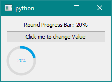
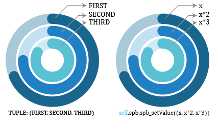

# PySide2extn

An extension for the Python PySide2 Qt Framework which expands the scope of the PySide2 package with many different modern widgets. Current release is occupied with two widget which are not natively present in the PySide2 package.

*RoundProgressBar*

<p align="center">
  
</p>

*SpiralProgressBar*

<p align="center">
  
</p>

:point_right: Go to [Home Page](https://anjalp.github.io/PySide2extn/) of Documentation for further Help

## Getting Started

* Install PySide2extn using `pip`

``` python
pip install PySide2extn
```

* Build from source: After cloning the repo, go to the directory and open `cmd` or `terminal`

``` bash
$ python3 setup.py sdist bdist_wheel
```

* Install from `.whl` file.

```python
pip install <PySide2extn------.whl>file
```

To verify that installation is complete, print out the `pip list` and search for the PySide2extn package. 

:point_right: For more details go to the [Official PySide2extn Documentation Getting Started](https://anjalp.github.io/PySide2extn/pages/get_started)

## Quick Demo

Quick demo help you to check weather you have successfully installed the Python Package. It comes with a UI loaded with all the widgets in this package with its different customized views. Users can easily differentiate the different styling elements used by widgets.

After installing the PySide2extn/PyQt5extn the users can try out quick demo by:

1. Open the `cmd` or `terminal`. Open `Python`

```python
>> from PySide2extn.demo import demo
>> demo.main()   #PRESS ENTER AND YOU WILL GET A DEMO APPLICATION
```

<p align="center">
  
</p>

## Documentation

Official Documentation for PySide2extn is detailed in: [PySide2extn Documentation](https://anjalp.github.io/PySide2extn/).

:point_right: [Getting Started](https://anjalp.github.io/PySide2extn/pages/get_started)

:point_right: [Examples](https://anjalp.github.io/PySide2extn/pages/example)

:point_right: [Classes](https://anjalp.github.io/PySide2extn/pages/classes)

:point_right: [Errors and Exceptions](https://anjalp.github.io/PySide2extn/pages/error&exception)

:point_right: [Version History](https://anjalp.github.io/PySide2extn/pages/version)

:point_right: [FAQ's](https://anjalp.github.io/PySide2extn/pages/faqs)

:point_right: [Official PySide2extn/PyQt5extn Form](https://forms.gle/yfKVK85sLLMJMCfJA)

## Examples

* **Default Round Progress Bar**

```python
import sys
from PySide2 import QtCore, QtWidgets, QtGui

from PySide2extn.RoundProgressBar import roundProgressBar #IMPORT THE EXTENSION LIBRARY

x = 0
p = 1

class MyWidget(QtWidgets.QWidget):
    def __init__(self):
        QtWidgets.QWidget.__init__(self)

        self.hello = 'Round Progress Bar'
        self.button = QtWidgets.QPushButton("Click me to change Value")
        self.text = QtWidgets.QLabel("Round Progress Bar")
        self.text.setAlignment(QtCore.Qt.AlignCenter)
        
        #CREATING THE ROUND PROGRESS BAR OBJECT
        self.rpb = roundProgressBar()
        
        self.layout = QtWidgets.QVBoxLayout()
        self.layout.addWidget(self.text)
        self.layout.addWidget(self.button)
        
        # ADDING THE ROUND PROGRESS BAR OBJECT TO THE                                             # BOTTOM OF THE LAYOUT
        self.layout.addWidget(self.rpb)

        self.setLayout(self.layout)
        self.button.clicked.connect(self.magic) #BUTTON PRESSED EVENT
        
    def magic(self):
        global x, p
        x = x + 10*p
        if x==100:
            p = -1
        elif x==0:
            p = 1
        self.rpb.rpb_setValue(x)        #CHANGING THE VALUE OF THE PROGRESS BAR
        out_text = 'Round Progress Bar: ' + str(x) + '%'
        self.text.setText(out_text)
        
if __name__ == "__main__":
    app = QtWidgets.QApplication(sys.argv)
    widget = MyWidget()
    widget.show()
    sys.exit(app.exec_())
```

<p align="center">
  
</p>

In this demo, we first created an object of the Round Progress Bar:

```python
self.rpb = roundProgressBar() #CREATING THE ROUND PROGRESS BAR OBJECT
```

After that calling the Round Progress Bar object to display the value of progress using:

```python
self.rpb.rpb_setValue(x) #CHANGING THE VALUE OF THE PROGRESS BAR
```

The `rpb_setValue(value)` takes an `int` as an argument and updates to change the value of the progress bar to the value given.

:point_right: For More examples on Round Progress Bar go to: [Official PySide2extn Documentation Examples](https://anjalp.github.io/PySide2extn/pages/examples/rpbExamples)

* **Default Spiral Progress Bar**

```python
import sys
from PySide2 import QtCore, QtWidgets, QtGui

#IMPORT THE EXTENSION  LIBRARY
from PySide2extn.SpiralProgressBar import spiralProgressBar 

x = 0
p = 1

class MyWidget(QtWidgets.QWidget):
    def __init__(self):
        QtWidgets.QWidget.__init__(self)

        self.hello = 'Spiral Progress Bar'
        self.button = QtWidgets.QPushButton("Click me to change Value")
        self.text = QtWidgets.QLabel("Spiral Progress Bar")
        self.text.setAlignment(QtCore.Qt.AlignCenter)
        
        #CREATING THE SPIRAL PROGRESS BAR OBJECT
        self.spb = spiralProgressBar()    
        
        #ADDING WIDGETS TO THE VERTICAL LAYOUT
        self.layout = QtWidgets.QVBoxLayout()
        self.layout.addWidget(self.text)
        self.layout.addWidget(self.button)
        
        # ADDING THE SPIRAL PROGRESS BAR OBJECT TO THE LAYOUT
        self.layout.addWidget(self.spb) 
        
        self.setLayout(self.layout)
        self.button.clicked.connect(self.magic) #BUTTON PRESSED EVENT
        
    def magic(self):
        global x, p
        x = x + 10*p
        if x==100:
            p = -1
        elif x==0:
            p = 1
            
        #CHANGING THE VALUE OF THE 3 DEFAULT PROGRESS BAR
        self.spb.spb_setValue((x, x*2, x*3)) 
        
        out_text = 'Spiral Progress Bar: '  
        out_text = out_text + str(x) + '%, ' + str(2*x) + '%, ' + str(3*x) + '%'
        self.text.setText(out_text)
        
if __name__ == "__main__":
    app = QtWidgets.QApplication(sys.argv)
    widget = MyWidget()
    widget.show()
    sys.exit(app.exec_())
```

<p align="center">
  
</p>

- Here first create a spiralProgressBar object and then add the progress bar to a layout and control the steps of the progress bar by the clicking of the button. 

  ```python
  self.spb = spiralProgressBar()		
  ```

- Here we create a spiralProgressBar object instance and then use the `self.spb` as the spiral progress bar to influence its charactor like:

  ```python
  self.spb.spb_setValue((x, x*2, x*3))
  ```

- Since the default progress bar has 3 individual concentric circle, where each can be controlled individually, we pass a tuple containing the individual value for manipulating each concentric progress bar, to the function `spb_setValue()` , which only accepts a tuple of length equal to the number of concentric progress bar. Every function which can manipulate the properties of the Spiral Progress Bar uses the same idea. The order of entering the value are shown below:

<p align="center">
  
</p>

:point_right: For More examples on Spiral Progress Bar go to: [Official PySide2extn Documentation Examples](https://anjalp.github.io/PySide2extn/pages/examples/spbExamples)

## Help

- **PySide2extn/PyQt5extn is not working in my setup**: Go to Github [PySide2extn](https://github.com/anjalp/PySide2extn) repo. and raise an issue or just fill the official [PySide2extn/PyQt5extn Form](https://forms.gle/yfKVK85sLLMJMCfJA).
- **Unknown errors**: Raise a GitHub issue or fill the official [PySide2extn/PyQt5extn Form](https://forms.gle/yfKVK85sLLMJMCfJA)

## Support

- Please feel free to contribute to the project by sharing the idea you have, which is not natively present in the PySide2/PyQt5 but essential for your workflow.
- You can fill up the official [PySide2extn/PyQt5extn Form](https://forms.gle/yfKVK85sLLMJMCfJA) where you just Brief the idea you have and also provide an active email address which is required for us to connect you.
- If your idea worth the use, then definitely it will be available in the next update of the PySide2extn/PyQt5extn.
- If this package made your life easy, then please share your experience with us [Here](https://forms.gle/yfKVK85sLLMJMCfJA)

:smiley: Support my work by forking or downloading this project, check it out, and [share the experience](https://forms.gle/yfKVK85sLLMJMCfJA).

:smiley: Support like this motivates me to do more creative, work for Open Source.

