# Class: RoundProgressBar

RoundProgressBar widget provides a fully customizable round progress bar with 6 different style to choose from. *See below*

<p align="center">
  
</p>

<p align="center">
  
</p>


## Synopsis

### Functions

* [def rpb_setMinimumSize(width, height)](#pyside2qtwidgtesroundprogressbarrpb_setminimumsizewidth-height)
* [def rpb_setMaximumSize(width, height)](#pyside2qtwidgtesroundprogressbarrpb_setmaximumsizewidth-height)
* [def rpb_setMinimum(minValue)](#pyside2qtwidgtesroundprogressbarrpb_setminimummin)
* [def rpb_setMaximum(maxValue)](#pyside2qtwidgtesroundprogressbarrpb_setmaximummax)
* [def rpb_setRange(minValue, maxValue)](#pyside2qtwidgtesroundprogressbarrpb_setrangemin-max)
* [def rpb_setInitialPos(positionFlag)](#pyside2qtwidgtesroundprogressbarrpb_initialpospositionflags)
* [def rpb_setValue(value)](#pyside2qtwidgtesroundprogressbarrpb_setvaluevalue)
* [def rpb_reset()](#pyside2qtwidgtesroundprogressbarrpb_reset)
* [def rpb_setGeometry(posX, posY)](#pyside2qtwidgtesroundprogressbarrpb_setgeometryposx-posy)
* [def rpb_setLineWidth(width)](#pyside2qtwidgtesroundprogressbarrpb_setlinewidthwidth)
* [def rpb_setLineColor((R, G, B))](#pyside2qtwidgtesroundprogressbarrpb_setlinecolorr-g-b)
* [def rpb_setPathColor((R, G, B))](#pyside2qtwidgtesroundprogressbarrpb_setpathcolorr-g-b)
* [def rpb_setPathWidth(width)](#pyside2qtwidgtesroundprogressbarrpb_setpathwidthwidth)
* [def rpb_setDirection(directionFlag)](#pyside2qtwidgtesroundprogressbarrpb_setdirectiondirectionflag)
* [def rpb_setBarStyle(styleFlag)](#pyside2qtwidgtesroundprogressbarrpb_setbarstylestyleflag)
* [def rpb_setLineStyle(styleFlag)](#pyside2qtwidgtesroundprogressbarrpb_setlinestylelinestyleflags)
* [def rpb_setLineCap(capFlag)](#pyside2qtwidgtesroundprogressbarrpb_setlinecaplinecapflags)
* [def rpb_setTextColor((R, G, B))](#pyside2qtwidgtesroundprogressbarrpb_settextcolorr-g-b)
* [def rpb_setTextFont(font)](#pyside2qtwidgtesroundprogressbarrpb_settextfontfontflags)
* [def rpb_setTextFormat(typeFlags)](#pyside2qtwidgtesroundprogressbarrpb_settextformattypeflags)
* [def rpb_setTextRatio(ratio)](#pyside2qtwidgtesroundprogressbarrpb_settextratioratio)
* [def rpb_setTextWidth(width)](#pyside2qtwidgtesroundprogressbarrpb_settextwidthwidth)
* [def rpb_setCircleColor((R, G, B))](#pyside2qtwidgtesroundprogressbarrpb_setcirclecolorr-g-b)
* [def rpb_setCircleRatio(ratio)](#pyside2qtwidgtesroundprogressbarrpb_setcircleratioratio)
* [def rpb_setPieColor((R, G, B))](#pyside2qtwidgtesroundprogressbarrpb_setpiecolorr-g-b)
* [def rpb_setPieRatio(ratio)](#pyside2qtwidgtesroundprogressbarrpb_setpieratioratio)
* [def rpb_enbaleText(bool)](#pyside2qtwidgtesroundprogressbarrpb_enabletextbool)
* [def rpb_getSize()](#pyside2qtwidgtesroundprogressbarrpb_getsize)
* [def rpb_getValue()](#pyside2qtwidgtesroundprogressbarrpb_getvalue)
* [def rpb_getRange()](#pyside2qtwidgtesroundprogressbarrpb_getrange)
* [def rpb_getTextWidth()](#pyside2qtwidgtesroundprogressbarrpb_gettextwidth)

## Detailed Description

<p align="center">
  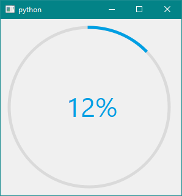
</p>


A progress bar is used to give the user an indication of the progress of an operation and to reassure them that the application is still running. A round Progress bar does the same function with the progress indicated moves in a circular pattern.

The round progress bar uses the concept of *steps* . You set it up by specifying the minimum and maximum possible step values, and it will display the percentage of steps that have been completed when you later give it the current step value. The percentage is calculated by dividing the progress (`value()` - `minimum`)/(`maximum` - `minimum`)

You can specify the minimum and maximum number of steps with `rpb_setMinimum()` and `rpb_setMaximum`() The current number of steps is set with `rpb_setValue()` The progress bar can be rewound to the beginning with `rpb_reset()`

### Naming Convention 

As the PySide2/PyQt5 library is so big and most of the common name is occupied by the various methods in the class, I was limited to use custom name for the methods in the RoundProgressBar class, so I decided to go for a **prefix at the beginning** of each method name so that it is easy to remember. So  to modify the round progress bar style, text, color, etc each time, the method name has to be called with a **prefix of `rpb_`** . So the idea remains the same, eg: that if you want to set the maximum value of progress bar, call the method `rpb_setMaximum()` and pass the maximum as an argument. This method applies to all other method used in this class.

The Round Progress Bar Consist of **5 parts**: **Text**, **Line**, **Path**, **Circle** and **Pie**. Each of this can be modified individually in terms of color, size etc.

<p align="center">
  
</p>

<p align="center">
  
</p>


## Default Settings: Round Progress Bar

During the first round progress bar creation you will see a round progress bar with the following  default properties: 

* **Style**: Donet
* **Size**: Dynamic: Changes with change in frame size.
* **Range**: 0 to 100
* **Value**: 12%
* **Start Position**: North
* **Direction of Progress**: Clockwise
* **Text Type**: Percentage
* **Text Font**: Segoe UI
* **Text Color**: (0, 159, 227)
* **Text Size**: Dynamic: changes with change in size of round Progress Bar.
* **Line Width**: 5px
* **Line Color**: (0, 159, 227)
* **Line Cap**: Square Cap
* **Line Style**: Solid Line
* **Path Width**: 5px
* **Path Color**: (218, 218, 218)

As seen each of the above property and much more can be changes, refer below:

See: [Example](https://anjalp.github.io/PySide2extn/pages/examples/rpbExamples)

## Class roundProgressBar()

Construct a round progress bar with given parent

By default: This gives us a `Donet` type of round progress bar with minimum and maximum set at 0, 100 with the current Value as 12%.

```python
#INITIALISING A NEW ROUND PROGRESS BAR
import sys
from PySide2 import QtCore, QtWidgets, QtGui
from PySide2exnt.RoundProgressBar import roundProgressBar #IMPORT THE MODULES

class MyWidget(QtWidgets.QWidget):
    def __init__(self):
        QtWidgets.QWidget.__init__(self)

        self.rpb = roundProgressBar() #CREATING A ROUND PROGRESS BAR OBJECT
        
        self.layout = QtWidgets.QVBoxLayout()
        self.layout.addWidget(self.rpb)
        self.setLayout(self.layout)

if __name__ == "__main__":
    app = QtWidgets.QApplication(sys.argv)
    widget = MyWidget()
    widget.show()
    sys.exit(app.exec_())
```

***

### ***PySide2.QtWidgtes.roundProgressBar.rpb_setMinimumSize(width, height)***

**Parameters** : width, height in `int`

Set the minimum size of the progress bar by passing width and height as argument respectively. By fixing the minimum size the user is limiting the minimum size of the progress bar to the value entered, and when the window size increases round progress bar automatically increases in size.

By Default the minimum size is set to 12*size of line width.

***

### ***PySide2.QtWidgtes.roundProgressBar.rpb_setMaximumSize(width, height)***

**Parameters** : width, height in `int`

Set the maximum size of the progress bar by passing width and height provided as argument respectively. By fixing the maximum size the user is limiting the size of the progress bar to the value entered, and when the window size decrease much lower than the user entered widget maximum the round progress bar automatically reduces the size (until the user manually specifies the minimum size of the widget).

By default the maximum size is the size of the canvas itself, i.e. dynamic size change.

***

### ***PySide2.QtWidgtes.roundProgressBar.rpb_setMinimum(min)***

**Parameters** : min value for the progress bar

Set the round progress bar minimum value to `min`.

By default the minimum value is 0.

See [Example](https://anjalp.github.io/PySide2extn/pages/examples/rpbExamples#2-minimum-maximum-and-range)

***

### ***PySide2.QtWidgtes.roundProgressBar.rpb_setMaximum(max)***

**Parameters** : max value for the progress bar

Set the round progress bar minimum value to `max`.

By default the maximum value is 100.

See [Example](https://anjalp.github.io/PySide2extn/pages/examples/rpbExamples#2-minimum-maximum-and-range)

***

### ***PySide2.QtWidgtes.roundProgressBar.rpb_setRange(min, max)***

**Parameter** : min and max range

Sets the minimum and maximum range of the round progress bar.

By default the range is (0, 100)

See [Example](https://anjalp.github.io/PySide2extn/pages/examples/rpbExamples#2-minimum-maximum-and-range)

***

### ***PySide2.QtWidgtes.roundProgressBar.rpb_InitialPos(positionFlags)***

**Parameter**: Position Flag: `North`, `South`, `East` `West` as string.

<p align="center">
  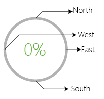
</p>


By default: Initial Position is `North`

```python
#EXAMPLE OF USING INITIAL POSITION FLAGS
self.rpb.rpb_setInitialPos('South')
```

Output: 

<p align="center">
  
</p>

See [Example](https://anjalp.github.io/PySide2extn/pages/examples/rpbExamples#5-starting-position)


***

### ***PySide2.QtWidgtes.roundProgressBar.rpb_setValue(value)***

**Parameter**: value in `int`

The value should be between the min and the max range and the following equation is used to calculate the %:  (`value()` - `minimum`)/(`maximum` - `minimum`).

By Default value is set at 12%

```python
#USING THE SETVALUE METHOD:
self.rpb.rpb_setValue(96)
```

<p align="center">
  
</p>


***

### ***PySide2.QtWidgtes.roundProgressBar.rpb_reset()***

Makes the progress pointer to the minimum value. i.e. 0%.

***

### ***PySide2.QtWidgtes.roundProgressBar.rpb_setGeometry(posX, posY)***

**Parameter**: posX and posY in `int`

This moves the origin coordinated of the round progress bar from (0, 0) to (posX, posY).

***

### ***PySide2.QtWidgtes.roundProgressBar.rpb_setLineWidth(width)***

**Parameter**: width in `int`

Sets the width of the line to the given `width` . In this way you can increase or decrease the width of the line. By default line width is 5px

```python
#INCREASING THE LINW WIDTH
self.rpb.rpb_setLineWidth(10)
```

<p align="center">
  
</p>


***

### ***PySide2.QtWidgtes.roundProgressBar.rpb_setLineColor((R, G, B))***

**Parameters**: tuple of R, G, B

Changes the color of the line to the specified R, G, B spectrum. 

By default line color is : (0, 159, 227)

```python
#CHANGE THE LINE COLOR
self.rpb.rpb_setLineColor((255, 0, 0)) #CHANGING THE LINE COLOR TO RED
```

<p align="center">
  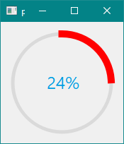
</p>

See [Example](https://anjalp.github.io/PySide2extn/pages/examples/rpbExamples#4-change-the-progress-bar-colors)


***

### ***PySide2.QtWidgtes.roundProgressBar.rpb_setPathWidth(width)***

**Parameter**: width in `int`

Sets the width of the path to the given `width` . In this way you can increase or decrease the width of the path. By default path width is 5px

```python
#INCREASING THE LINW WIDTH
self.rpb.rpb_setPathWidth(15)
```

<p align="center">
  
</p>

See [Example](https://anjalp.github.io/PySide2extn/pages/examples/rpbExamples#9-path-properties)


***

### ***PySide2.QtWidgtes.roundProgressBar.rpb_setPathColor((R, G, B))***

**Parameters**: tuple of R, G, B

Changes the color of the path to the specified R, G, B spectrum. 

By default path color is : (218, 218, 218)

```python
#CHANGE THE PATH COLOR
self.rpb.rpb_setPathColor((0, 0, 0)) #CHANGING THE PATH COLOR TO BLACK
```

<p align="center">
  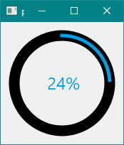
</p>

See [Example](https://anjalp.github.io/PySide2extn/pages/examples/rpbExamples#4-change-the-progress-bar-colors)


***

### ***PySide2.QtWidgtes.roundProgressBar.rpb_setDirection(directionFlag)***

**Parameter**: Direction Flag: `Clockwise` or `AntiClockwise` as string.

Sets the direction of the progress bar motion to clockwise or anticlockwise direction.

By default the direction is `Clockwise`

<p align="center">
  
</p>

See [Example](https://anjalp.github.io/PySide2extn/pages/examples/rpbExamples#6-direction-of-progress)


***

### ***PySide2.QtWidgtes.roundProgressBar.rpb_setBarStyle(styleFlag)***

**Parameter**: Style Flags: `Donet`, `Line`, `Pizza`, `Pie`, `Hybrid1` and `Hybrid2` as string.

As told earlier the round progress bar has total of 6 different types of as listed below:

<p align="center">
  
</p>


Just type the style flag in the field to take palce.

```python
#SETTING THE STYLE OF THE ROUND PROGRESS BAR:
self.rpb.rpb_setCircleRatio(1) #SEE BELOW FOR INFO ON CIRCLE
self.rpb.rpb_setBarStyle('Pizza')
```

Output:

<p align="center">
  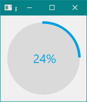
</p>

See [Example](https://anjalp.github.io/PySide2extn/pages/examples/rpbExamples#3-changing-the-progress-bar-style)


***

### ***PySide2.QtWidgtes.roundProgressBar.rpb_setLineCap(linecapFlags)***

**Parameter**: Line Cap Flags: `SquareCap` and `RoundCap` as string.

This settings changes the stroke cap to either square or to a circle. See below:

<p align="center">
  
</p>


By Default the line cap is set to `SquareCap`.

```python
#SETTING THE LINE CAP
self.rpb.rpb_setLineCap('RoundCap')
```

See [Example](https://anjalp.github.io/PySide2extn/pages/examples/rpbExamples#8-line-properties)

***

### ***PySide2.QtWidgtes.roundProgressBar.rpb_setLineStyle(linestyleflags)***

**Parameters**: Line Style Flags: `SolidLine`, `DotLine` and `DashLine` as string.

The line style setting from the continuous Solid line to the dot lines to the dash line.

```python
#LINE STYLE
self.rpb.rpb_setLineStyle('DotLine')
```

<p align="center">
  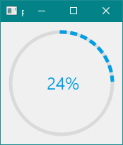
</p>


```python
#LINE STYLE:
self.rpb.rpb_setLineStyle('DashLine')
```

<p align="center">
  
</p>

See [Example](https://anjalp.github.io/PySide2extn/pages/examples/rpbExamples#8-line-properties)


***

### ***PySide2.QtWidgtes.roundProgressBar.rpb_setTextColor((R, G, B))***

**Parameter**: Tuple in the form : R, G, B

Set the text color of your desire with passing a tuple of R, G, B.

```python
#TEXT COLOR
self.rpb.rpb_setTextColor((255, 220, 0)) #SETTING THE COLOR TO YELLOW
```

<p align="center">
  
</p>

See [Example](https://anjalp.github.io/PySide2extn/pages/examples/rpbExamples#4-change-the-progress-bar-colors)


***

### ***PySide2.QtWidgtes.roundProgressBar.rpb_setTextFont(fontFlags)***

**Parameters**: Font names like  `Arial`, `Segoe UI`, `Times` , `Times New Roman` e.t.c. default fonts of windows/linux/macOS.

By default the text font is `Segoe UI`

```python
#SETTING THE TEXT FONT
self.rpb.rpb_setTextFont('Times')
```

<p align="center">
  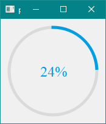
</p>

See [Example](https://anjalp.github.io/PySide2extn/pages/examples/rpbExamples#7-text-properties)


***

### ***PySide2.QtWidgtes.roundProgressBar.rpb_setTextFormat(typeflags)***

**Parameter**: Text type flags: `Value` or `Percentage` as string

Choosing the value will display the raw value of the progress, while setting it to the percentage will display the percentage occupied by the value between the minimum and maximum.

```python
#TEXT TYPE
self.rpb.rpb_setMaximum(360)
self.rpb.rpb_setTextFormat('Value') #SET THE TEXT TYPE TO VALUE
self.rpb.rpb_setValue(180)
```

<p align="center">
  
</p>


```python
self.rpb.rpb_setMaximum(360)
self.rpb.rpb_setTextFormat('Percentage') #SET THE TEXT TYPE TO PERCENTAGE
self.rpb.rpb_setValue(180)
```

<p align="center">
  
</p>

See the above example where we set the maximum value of the progress bar to 360, making the range from 0 to 360, then set the value to 180, we can see when the text format is in `Value` it displays 180 on the other hand when the text format is `Percentage` it shows as 50%.

See [Example](https://anjalp.github.io/PySide2extn/pages/examples/rpbExamples#7-text-properties)

***

### ***PySide2.QtWidgtes.roundProgressBar.rpb_setTextRatio(ratio)***

**Parameters**: ratio in `int` 

By default the ratio is set to 8, which makes the text size 1/8 of the size of the round progress bar and this is even dynamic i.e. as the size of the round progress bar changes the text size also changes automatically. You can set the text ratio to any value > 2 i.e. from 3 to any value as value < 2 will collide with the progress bar significantly.

```python
#TEXT RATIO
self.rpb.rpb_setTextRatio(3) #SET THE TEXT SIZE TO 1/3 OF SIZE OF THE ROUND PROGRESS BAR
```

<p align="center">
  
</p>

See [Example](https://anjalp.github.io/PySide2extn/pages/examples/rpbExamples#7-text-properties)


***

### ***PySide2.QtWidgtes.roundProgressBar.rpb_setTextWidth(width)***

**Parameters**: width in `int`

By default the text font is dynamic i.e. it changes with the change in shape of the round progress bar, but you can always change this by making a constant text width, making the dynamic text feature turn off. This method makes the width you entered as the width of the text.

```python
#TEXT WIDTH 
self.rpb.rpb_setTextWidth(30)
```

<p align="center">
  
</p>

Remember that the using rpb_setTextRatio() enables the dynamic text, which makes the text size change with respect to the change in size of the round progress bar, but the method rpb_setTextWidth() disables the dynamic text feature and makes the constant text size, with no effect in the change in size of the round progress bar.

See [Example](https://anjalp.github.io/PySide2extn/pages/examples/rpbExamples#7-text-properties)

***

### ***PySide2.QtWidgtes.roundProgressBar.rpb_setCircleColor((R, G, B))***

**Parameters**: Tuple in the form : R, G, B

Changes the color of the circle in the bar style `Pizza` and `Hybrid1`.

Default color is :(218, 218, 218)

```python
#CHANGE THE COLOR OF THE CIRCLE
self.rpb.rpb_setBarStyle('Hybrid1') #CHANGE THE BAR STYLE TO HYBRID
self.rpb.rpb_setCircleColor((200, 120, 20)) #CHANGE THE COLOR
```

<p align="center">
  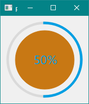
</p>

See [Example](https://anjalp.github.io/PySide2extn/pages/examples/rpbExamples#4-change-the-progress-bar-colors)


***

### ***PySide2.QtWidgtes.roundProgressBar.rpb_setCircleRatio(ratio)***

**Parameter**: ratio in `int`

The circle size is determined by the size of the progress bar, i.e. by default the ration is set to 0.8 means the size of the circle will be 0.8 times the size of the round progress bar, but you can change this by using this method. 

```python
#CIRCLE RATIO EXAMPLE
self.rpb.rpb_setCircleRatio(0.5) #MAKES THE CIRCLE 0.5*SIZE OF THE PROGRESS BAR
```

<p align="center">
  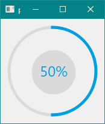
</p>


***

### ***PySide2.QtWidgtes.roundProgressBar.rpb_setPieColor((R, G, B))***

**Parameters**: Tuple in the form : R, G, B

Changes the color of the pie in the bar style `Pie` and `Hybrid2`.

Default color is :(218, 218, 218)

```python
#PIE COLOR
self.rpb.rpb_setBarStyle('Pie')
self.rpb.rpb_setPieColor((0, 150, 120))
self.rpb.rpb_setValue(45)
```

<p align="center">
  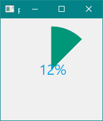
</p>

See [Example](https://anjalp.github.io/PySide2extn/pages/examples/rpbExamples#4-change-the-progress-bar-colors)


***

### ***PySide2.QtWidgtes.roundProgressBar.rpb_setPieRatio(ratio)***

**Parameter**: ratio in `int`

Pie size by default is 0.8*(minimum size, maximum size), but this can be changes by changing the value of the ratio, this method can be used in the two bar style type: `Pie` and `Hybrid2`

```python
#PIE RATIO
self.rpb.rpb_setBarStyle('Hybrid2')
self.rpb.rpb_setPieColor((0, 150, 120))
self.rpb.rpb_setValue(45)
self.rpb.rpb_setPieRatio(0.9)
```

<p align="center">
  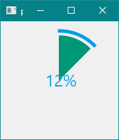
</p>


***

### ***PySide2.QtWidgtes.roundProgressBar.rpb_enableText(bool)***

**Parameter**: `True` or `False` 

Enable or disable the text inside the round progress bar.

***

### ***PySide2.QtWidgtes.roundProgressBar.rpb_getSize()***

**Return**:  `int`

This method returns the size of the round progress bar in `int`.

***

### ***PySide2.QtWidgtes.roundProgressBar.rpb_getValue()***

**Return**: `int`

This method returns the current value displayed by the round progress bar in `int`.

***

### ***PySide2.QtWidgtes.roundProgressBar.rpb_getRange()***

**Return**: tuple of (minimum, maximum)

Returns the maximum and minimum value of the round progress bar.

***

### ***PySide2.QtWidgtes.roundProgressBar.rpb_getTextWidth()***

**Return**: `int`.

This method returns the width of the text displaying the value in the round progress bar.

***

Also See: [Round Progress Bar Examples](https://anjalp.github.io/PySide2extn/pages/examples/rpbExamples)