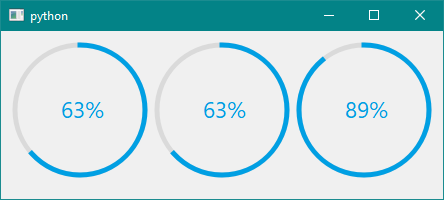
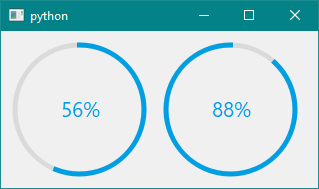
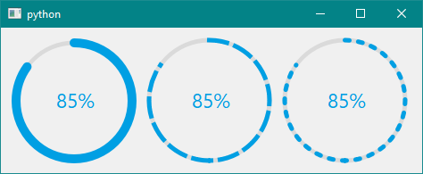
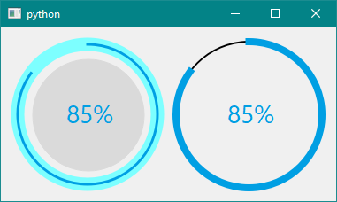

# Example: RoundProgressBar

These Example codes are written using the PySide2 Python Package, but the same codes can be written using the PyQt5, the only difference made in the code is in the import statements rest all work the same.

### **1. Default Round Progress Bar**

```python
import sys
from PySide2 import QtCore, QtWidgets, QtGui

from PySide2extn.RoundProgressBar import roundProgressBar #IMPORT THE EXTENSION LIBRARY

x = 0
p = 1

class MyWidget(QtWidgets.QWidget):
    def __init__(self):
        QtWidgets.QWidget.__init__(self)

        self.hello = 'Round Progress Bar'
        self.button = QtWidgets.QPushButton("Click me to change Value")
        self.text = QtWidgets.QLabel("Round Progress Bar")
        self.text.setAlignment(QtCore.Qt.AlignCenter)
        
        #CREATING THE ROUND PROGRESS BAR OBJECT
        self.rpb = roundProgressBar()
        
        self.layout = QtWidgets.QVBoxLayout()
        self.layout.addWidget(self.text)
        self.layout.addWidget(self.button)
        
        # ADDING THE ROUND PROGRESS BAR OBJECT TO THE                                             # BOTTOM OF THE LAYOUT
        self.layout.addWidget(self.rpb)

        self.setLayout(self.layout)
        self.button.clicked.connect(self.magic) #BUTTON PRESSED EVENT
        
    def magic(self):
        global x, p
        x = x + 10*p
        if x==100:
            p = -1
        elif x==0:
            p = 1
        self.rpb.rpb_setValue(x)        #CHANGING THE VALUE OF THE PROGRESS BAR
        out_text = 'Round Progress Bar: ' + str(x) + '%'
        self.text.setText(out_text)
        
if __name__ == "__main__":
    app = QtWidgets.QApplication(sys.argv)
    widget = MyWidget()
    widget.show()
    sys.exit(app.exec_())
```

Output:

<p align="center">
  
</p>


In this demo, we first created an object of the Round Progress Bar:

```python
self.rpb = roundProgressBar() #CREATING THE ROUND PROGRESS BAR OBJECT
```

After that calling the Round Progress Bar object to display the value of progress using:

```python
self.rpb.rpb_setValue(x) #CHANGING THE VALUE OF THE PROGRESS BAR
```

The `rpb_setValue(value)` takes an `int` as an argument and updates to change the value of the progress bar to the value given.

***

### **2. Minimum, Maximum, and Range**

```python
import sys
from PySide2 import QtCore, QtWidgets, QtGui
#IMPORTING THE MODULE
from PySide2extn.RoundProgressBar import roundProgressBar

class MyWidget(QtWidgets.QWidget):
    def __init__(self):
        QtWidgets.QWidget.__init__(self)
        
        #CLASS INSTANCE
        self.rpb = roundProgressBar()
        self.rpb2 = roundProgressBar()
        self.rpb3 = roundProgressBar()

        #SETTING THE RANGE : 
        self.rpb.rpb_setMaximum(720) 
        self.rpb2.rpb_setRange(0, 720)
        self.rpb3.rpb_setRange(0, 1000)
        
        #SETTING THE VALUE
        self.rpb.rpb_setValue(456)
        self.rpb2.rpb_setValue(456)
        self.rpb3.rpb_setValue(890)

        self.layout = QtWidgets.QHBoxLayout()
        self.layout.addWidget(self.rpb)
        self.layout.addWidget(self.rpb2)
        self.layout.addWidget(self.rpb3)
        self.setLayout(self.layout)

if __name__ == "__main__":
    app = QtWidgets.QApplication(sys.argv)
    widget = MyWidget()
    widget.show()
    sys.exit(app.exec_())
```

<p align="center">
  
</p>


The Maximum and Minimum values of the progress bar can be set using the method: `rpb_setMaximum()`, and `rpb_setMinimum()`. By default, the maximum value is set to 100, and the minimum to 0. This can be changed as users use cases. The same result can be achieved by the user using the function: `rpb_setRange()`. The range function takes two parameters: `minimum` and `maximum` in order.

***

### **3. Changing the Progress Bar Style**

The Round Progress Bar Class has 6 types of different types of Round Progress bar, the default is the `Donet` type of progress bar which you see in the above example, the other types are illustrated in the image below:

<p align="center">
  
</p>


To change the Progress Bar style, use the function:

```python
self.rpb_setBarStyle(Style_Name)
```

where the different style names are:

```python
Style_Nmae: 
    Donet (Default)
    Line
    Pie
    Pizza
    Pie
    Hybrid1
    Hybrid2
```

Example:

```python
import sys
from PySide2 import QtCore, QtWidgets, QtGui
from PySide2extn.RoundProgressBar import roundProgressBar

class MyWidget(QtWidgets.QWidget):
    def __init__(self):
        QtWidgets.QWidget.__init__(self)

        self.rpb = roundProgressBar()
        self.rpb.rpb_setBarStyle('Pizza') #CHANGE THE BAR STYLE TO : 'Pizza'

        self.layout = QtWidgets.QVBoxLayout()
        self.layout.addWidget(self.rpb)
        self.setLayout(self.layout)

if __name__ == "__main__":
    app = QtWidgets.QApplication(sys.argv)
    widget = MyWidget()
    widget.show()
    sys.exit(app.exec_())
```

Output:

<p align="center">
  
</p>

***

### **4. Change the Progress Bar Colors**

For changing the progress bar style a few things should be kept in mind: The progress bar is divided into Five parts: Line, Path, Circle, Pie, Text

<p align="center">
  
</p>

<p align="center">
  
</p>


For each parts, we have the following variable which can be changed: Color, Width, Size, Cap, Stroke e.t.c from which the color settings are demonstrated below.

```python
#Line:
object.rpb_setLineColor((R, G, B)) #ARGUMENT RGB AS A TUPLE

#Path:
object.rpb_setPathColor((R, G, B)) #ARGUMENT RGB AS A TUPLE

#Text:
object.rpb_setTextColor((R, G, B)) #ARGUMENT RGB AS A TUPLE

#Circle:
object.rpb_setCircleColor((R, G, B)) #ARGUMENT RGB AS A TUPLE

#Pie:
object.rpb_setPieColor((R, G, B)) #ARGUMENT RGB AS A TUPLE

```

****

### **5. Starting Position**

```python
import sys
from PySide2 import QtCore, QtWidgets, QtGui
#IMPORTING THE PACKAGE
from PySide2extn.RoundProgressBar import roundProgressBar

class MyWidget(QtWidgets.QWidget):
    def __init__(self):
        QtWidgets.QWidget.__init__(self)
        
        #CREATING THE ROUNDPROGRESSBAR CLASS INSTANCE
        self.rpb = roundProgressBar()
        self.rpb2 = roundProgressBar()
        
        #DEFINING THE INITIAL POSITION OF THE PROGRESS BAR
        self.rpb.rpb_setInitialPos('South') #START FROM SOUTH
        self.rpb2.rpb_setInitialPos('East')  #START FROM EAST
        
        #LAYOUT OF THE PROGRESS BAR
        self.layout = QtWidgets.QHBoxLayout()
        self.layout.addWidget(self.rpb)
        self.layout.addWidget(self.rpb2)
        self.setLayout(self.layout)

if __name__ == "__main__":
    app = QtWidgets.QApplication(sys.argv)
    widget = MyWidget()
    widget.show()
    sys.exit(app.exec_())
```

<p align="center">
  
</p>


* A progress bar can have 4 starting positions: `North`, `South`, `East`, and `West`. By default the position is `North`. Users can change the position by using the method: `rpb_setInitialPos()`, which takes a parameter if position string.

  ```python
  self.rpb.rpb_setInitialPos('West') #WEST AS STARTING POSITION.
  ```

  <p align="center">
    
  </p>

  ***

### **6. Direction of Progress**

```python
import sys
from PySide2 import QtCore, QtWidgets, QtGui
#IMPORTING THE MODULE
from PySide2extn.RoundProgressBar import roundProgressBar

class MyWidget(QtWidgets.QWidget):
    def __init__(self):
        QtWidgets.QWidget.__init__(self)
        
        #CLASS INSTANCE
        self.rpb = roundProgressBar()
        self.rpb2 = roundProgressBar()
        
        #CHANGING THE DIRECTION
        self.rpb.rpb_setDirection('Clockwise')
        self.rpb2.rpb_setDirection('AntiClockwise')
        
        #SETTING THE VALUE
        self.rpb.rpb_setValue(56)
        self.rpb2.rpb_setValue(88)

        self.layout = QtWidgets.QHBoxLayout()
        self.layout.addWidget(self.rpb)
        self.layout.addWidget(self.rpb2)
        self.setLayout(self.layout)

if __name__ == "__main__":
    app = QtWidgets.QApplication(sys.argv)
    widget = MyWidget()
    widget.show()
    sys.exit(app.exec_())
```

<p align="center">
  
</p>


* The direction of progress denotes the moving direction of the progress bar. By default, it is `Clockwise`, which can be changed by the method: `rpb_setDirection()` which accepts a string corresponding to the direction: `Clockwise` and `AntiClockwise`. It may raise an `Exception` if the string is not matched.

***

### **7. Text Properties**

```python
import sys
from PySide2 import QtCore, QtWidgets, QtGui
#IMPORTING THE MODULE
from PySide2extn.RoundProgressBar import roundProgressBar

class MyWidget(QtWidgets.QWidget):
    def __init__(self):
        QtWidgets.QWidget.__init__(self)
        
        #CLASS INSTANCE
        self.rpb = roundProgressBar()
        self.rpb2 = roundProgressBar()
        self.rpb3 = roundProgressBar()

        #SETTING THE RANGE : MIN-0 & MAX:360
        self.rpb.rpb_setRange(0, 360) 
        self.rpb2.rpb_setRange(0, 360)
        self.rpb3.rpb_setRange(0, 360)
        
        #CHANGING THE STYLE
        self.rpb.rpb_setBarStyle('Pizza')
        self.rpb2.rpb_setBarStyle('Hybrid2')

        #CHANGING THE TEXT TYPE : VALUE OR PERCENTAGE
        self.rpb.rpb_setTextFormat('Value')
        self.rpb2.rpb_setTextFormat('Percentage')

        #CHANGING THE TEXT SIZE
        self.rpb.rpb_setTextRatio(3)
        self.rpb2.rpb_setTextRatio(9)

        #CHANGING THE FONT
        self.rpb.rpb_setTextFont('Arial')
        self.rpb2.rpb_setTextFont('Times New Roman')

        #TEXT HIDDEN
        self.rpb3.rpb_enableText(False)
        
        #SETTING THE VALUE
        self.rpb.rpb_setValue(156)
        self.rpb2.rpb_setValue(156)

        self.layout = QtWidgets.QHBoxLayout()
        self.layout.addWidget(self.rpb)
        self.layout.addWidget(self.rpb2)
        self.layout.addWidget(self.rpb3)
        self.setLayout(self.layout)

if __name__ == "__main__":
    app = QtWidgets.QApplication(sys.argv)
    widget = MyWidget()
    widget.show()
    sys.exit(app.exec_())
```

<p align="center">
  
</p>

<p align="center">
  
</p>


This Example contains all the info that is needed for customization of the text inside the progress bar. It contains the following elements:

* **Text Format**

Text format denotes the format which should be used to display the output value of the progress bar. It can be a `Value` or a `Percentage`. From the above image, the first two progress bar has the same `rpb_setValue` of 156, but one is in `Percentage` and the other in `Value`. This may come in handy in certain situations. By default, the format is set to `Percentage`. The format can be set using the function: `rpb_setTextFormat()`, which accepts a string.

```python
#CHANGING THE TEXT TYPE : VALUE OR PERCENTAGE
self.rpb.rpb_setTextFormat('Value')
self.rpb2.rpb_setTextFormat('Percentage')
```

* **Text Ratio**

The text format signifies the size of the text concerning the size of the progress bar. It can range from 1/3 to 1/50 of the size of the progress bar. This method functions differently from the method `rpb_setTextWidth()` as the width increase the width of the text but it remains a constant when the size of the round progress bar size changes during the change in window size. This function `rpb_setTextRatio()` however increases the width concerning the real-time size of the round progress bar. This is demonstrated by the second image in the example. The second example picture contains the enlarged window. The method takes an `int` and sets it as the ratio. 

```python
#CHANGING THE TEXT SIZE
self.rpb.rpb_setTextRatio(3)   #1/3 OF SIZE OF THE PROGRESSBAR
self.rpb2.rpb_setTextRatio(9)   #1/9 OF SIZE OF PROGRESS BAR
```

* **Text Font**

The text inside the round progress bar has a default font: `Segoe UI`. This can be changed as shown in the example. It can have any standard font installed on the user's PC. The method used to change the font is `rpb_setTextFont()` and takes the name of the font as the parameter.

```python
#CHANGING THE FONT
self.rpb.rpb_setTextFont('Arial')
self.rpb2.rpb_setTextFont('Times New Roman')
```

* **Disable Text**

By default, the text is `Enabled`, but users can hide the text using the function: `rpb_enableText()`, which accepts a `bool`. 

```python
#TEXT HIDDEN
self.rpb3.rpb_enableText(False) #SEE THE IMAGE OF 3RD ROUNDPROGRESSBAR
```

***

### **8. Line Properties**

```python
import sys
from PySide2 import QtCore, QtWidgets, QtGui
#IMPORTING THE MODULE
from PySide2extn.RoundProgressBar import roundProgressBar

class MyWidget(QtWidgets.QWidget):
    def __init__(self):
        QtWidgets.QWidget.__init__(self)
        
        #CLASS INSTANCE
        self.rpb = roundProgressBar()
        self.rpb2 = roundProgressBar()
        self.rpb3 = roundProgressBar()

        #LINE WIDTH 
        self.rpb.rpb_setLineWidth(10)

        #LINE CAP
        self.rpb.rpb_setLineCap('RoundCap')
        self.rpb2.rpb_setLineCap('SquareCap')
        self.rpb3.rpb_setLineCap('RoundCap')

        #LINE STYLE
        self.rpb3.rpb_setLineStyle('DotLine')
        self.rpb2.rpb_setLineStyle('DashLine')
        
        #SETTING THE VALUE
        self.rpb.rpb_setValue(85)
        self.rpb2.rpb_setValue(85)
        self.rpb3.rpb_setValue(85)

        self.layout = QtWidgets.QHBoxLayout()
        self.layout.addWidget(self.rpb)
        self.layout.addWidget(self.rpb2)
        self.layout.addWidget(self.rpb3)
        self.setLayout(self.layout)

if __name__ == "__main__":
    app = QtWidgets.QApplication(sys.argv)
    widget = MyWidget()
    widget.show()
    sys.exit(app.exec_())
```

<p align="center">
  
</p>


The line has many customizable properties each of them is listed below.

* **Line Width**

Line width is the width of the line that display the progress. It is set to 5px default. The user can use the method `rpb_setLineWidth()` and pass the desired width in `px` as an `int` as the parameter.

```python
#LINE WIDTH 
self.rpb.rpb_setLineWidth(10)
```

* **Line Cap**

Line cap is the end of the stroke of the line. It can have two styles: `RoundCap` and `SquareCap`. The desired cap can be passed as a string to the method: `rpb_setLineCap()` which takes a string as a parameter. The image above gives a note on how the cap looks.

```python
#LINE CAP
self.rpb.rpb_setLineCap('RoundCap')
self.rpb2.rpb_setLineCap('SquareCap')
self.rpb3.rpb_setLineCap('RoundCap')
```

* **Line Style**

The line can be continuous `SolidLine` or can have a style:  `DashLine` or a `DotLine`. Each of these styles can be passed as a string to the method: `rpb_setLineStyle()`. In the image, you can spot the difference between the three styles.

```python
#LINE STYLE
self.rpb3.rpb_setLineStyle('DotLine')
self.rpb2.rpb_setLineStyle('DashLine')
```

*****

### **9. Path Properties**

```python
import sys
from PySide2 import QtCore, QtWidgets, QtGui

#IMPORTING THE MODULE
from PySide2extn.RoundProgressBar import roundProgressBar

class MyWidget(QtWidgets.QWidget):
    def __init__(self):
        QtWidgets.QWidget.__init__(self)
        
        #CLASS INSTANCE
        self.rpb = roundProgressBar()
        self.rpb2 = roundProgressBar()

        #CHANGING THE PROGRESSABR STYLE
        self.rpb.rpb_setBarStyle('Hybrid1')

        #CHANGING THE LINE WIDTH
        self.rpb.rpb_setLineWidth(3)
        self.rpb2.rpb_setLineWidth(8)

        #PATH WIDTH
        self.rpb.rpb_setPathWidth(15)
        self.rpb2.rpb_setPathWidth(2)

        #CHANGING THE PATH COLOR
        self.rpb.rpb_setPathColor((125, 255, 255))
        self.rpb2.rpb_setPathColor((0, 0, 0))
        
        #SETTING THE VALUE
        self.rpb.rpb_setValue(85)
        self.rpb2.rpb_setValue(85)

        self.layout = QtWidgets.QHBoxLayout()
        self.layout.addWidget(self.rpb)
        self.layout.addWidget(self.rpb2)
        self.setLayout(self.layout)

if __name__ == "__main__":
    app = QtWidgets.QApplication(sys.argv)
    widget = MyWidget()
    widget.show()
    sys.exit(app.exec_())
```

<p align="center">
  
</p>


The Path has 3 properties that can be changed and also the path is present in only two styles of the round progress bar: `Hybrid1` and the `Donet` styles. The following methods to modify the path is described below:

* **Path Width**

Similar to the line width corresponding to the line thickness in px, the path width corresponds to the thickness of the path. Path thickness by default is set to the thickness of the line. But changing it will result in some significant design gains. The method: `rpb_setPathWidth()` is used for setting the path width. It takes an `int` as a parameter and it should correspond to the width in `px`.

* **Path Color**

Path color method help to change the color of the path of the round Progress Bar path. The method : `rpb_setPathColor()` accepts a tuple in format: `(R, G, B)`.

```python
#CHANGING THE PATH COLOR
self.rpb.rpb_setPathColor((125, 255, 255))  #CYAN
self.rpb2.rpb_setPathColor((0, 0, 0))   #BLACK COLOR
```

***

Also See: [Class RoundProgressBar](https://anjalp.github.io/PySide2extn/pages/class/rpbClass)

