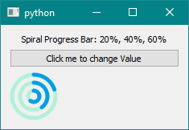
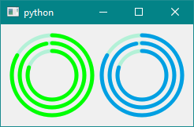
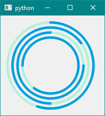
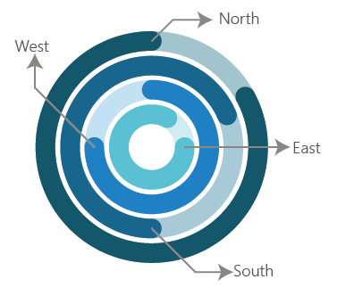
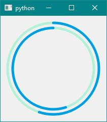
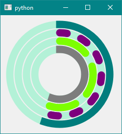

# Example: SpiralProgressBar

These Example codes are written using the PySide2 Python Package, but the same codes can be written using the PyQt5, the only difference made in the code is in the import statements rest all work the same.

### **1. Default Spiral Progress Bar**

```python
import sys
from PySide2 import QtCore, QtWidgets, QtGui

#IMPORT THE EXTENSION  LIBRARY
from PySide2extn.SpiralProgressBar import spiralProgressBar 

x = 0
p = 1

class MyWidget(QtWidgets.QWidget):
    def __init__(self):
        QtWidgets.QWidget.__init__(self)

        self.hello = 'Spiral Progress Bar'
        self.button = QtWidgets.QPushButton("Click me to change Value")
        self.text = QtWidgets.QLabel("Spiral Progress Bar")
        self.text.setAlignment(QtCore.Qt.AlignCenter)
        
        #CREATING THE SPIRAL PROGRESS BAR OBJECT
        self.spb = spiralProgressBar()    
        
        #ADDING WIDGETS TO THE VERTICAL LAYOUT
        self.layout = QtWidgets.QVBoxLayout()
        self.layout.addWidget(self.text)
        self.layout.addWidget(self.button)
        
        # ADDING THE SPIRAL PROGRESS BAR OBJECT TO THE LAYOUT
        self.layout.addWidget(self.spb) 
        
        self.setLayout(self.layout)
        self.button.clicked.connect(self.magic) #BUTTON PRESSED EVENT
        
    def magic(self):
        global x, p
        x = x + 10*p
        if x==100:
            p = -1
        elif x==0:
            p = 1
            
        #CHANGING THE VALUE OF THE 3 DEFAULT PROGRESS BAR
        self.spb.spb_setValue((x, x*2, x*3)) 
        
        out_text = 'Spiral Progress Bar: '  
        out_text = out_text + str(x) + '%, ' + str(2*x) + '%, ' + str(3*x) + '%'
        self.text.setText(out_text)
        
if __name__ == "__main__":
    app = QtWidgets.QApplication(sys.argv)
    widget = MyWidget()
    widget.show()
    sys.exit(app.exec_())
```

<p align="center">
  
</p>


- Here first create a spiralProgressBar object and then add the progress bar to a layout and control the steps of the progress bar by the clicking of the button. 

  ```python
  self.spb = spiralProgressBar()		
  ```

- Here we create a spiralProgressBar object instance and then use the `self.spb` as the spiral progress bar to influence its charactor like:

  ```python
  self.spb.spb_setValue((x, x*2, x*3))
  ```

- Since the default progress bar has 3 individual concentric circle, where each can be controlled individually, we pass a tuple containing the individual value for manipulating each concentric progress bar, to the function `spb_setValue()` , which only accepts a tuple of length equal to the number of concentric progress bar. Every function which can manipulate the properties of the Spiral Progress Bar uses the same idea. The order of entering the value are shown below:

<p align="center">
  
</p>


***

### **2. Maximum, Minimum and Range**

```python
import sys
from PySide2 import QtCore, QtWidgets, QtGui

#IMPORT THE EXTENSION LIBRARY
from PySide2extn.SpiralProgressBar import spiralProgressBar 

class MyWidget(QtWidgets.QWidget):
    def __init__(self):
        QtWidgets.QWidget.__init__(self)

        self.hello = 'Spiral Progress Bar'
        
        self.spbMinMax = spiralProgressBar()    #SPIRAL PROGRESSBAR OBJECT
        self.spbRange = spiralProgressBar()     #SPIRAL PROGRESS BAR OBJECT

        #SPIRAL PROGRESS BAR spbMinMax : GREEN COLOR
        self.spbMinMax.spb_setMinimum((0, 0, 0))    #SETTING THE MINIMUM VALUE
        self.spbMinMax.spb_setMaximum((360, 360, 360))   #SETTING THE MAXIMUM VALUE 
        #GREEN COLOR
        self.spbMinMax.spb_lineColor(((0, 255, 0), (0, 255, 0), (0, 255, 0)))  
        self.spbMinMax.spb_setValue((300, 350, 289))    #SET THE CURRENT VALUE
        
        #SPIRAL PROGRESS BAR spbRange :BLUE COLOR
        self.spbRange.spb_setRange((0, 0, 0), (360, 360, 360))  #SETTING THE RANGE
        self.spbRange.spb_setValue((300, 350, 289)) #SETTING CURRENT VALUE
        
        self.layout = QtWidgets.QHBoxLayout()
        self.layout.addWidget(self.spbMinMax)
        self.layout.addWidget(self.spbRange) 
        self.setLayout(self.layout)
        
if __name__ == "__main__":
    app = QtWidgets.QApplication(sys.argv)
    widget = MyWidget()
    widget.show()
    sys.exit(app.exec_())
```

<p align="center">
  
</p>


This example demonstrate the use of the three function to manipulate the Maximum and the Minimum value of the progress bar. The third function is just a simple substitute/short way of doing the things i.e. setting the Max and the Min value in one go. 

- In the code two spiral progress bar object instance is defined as:

  ```python
  self.spbMinMax = spiralProgressBar()    #SPIRAL PROGRESSBAR OBJECT
  self.spbRange = spiralProgressBar()     #SPIRAL PROGRESS BAR OBJECT
  ```

- Then set the maximum and minimum by the functions `spb_setMaximum()` and `spb_setMinimum()` for the instance `spbMinMax` . After that the 

  ```python
  #SPIRAL PROGRESS BAR spbMinMax : GREEN COLOR
  self.spbMinMax.spb_setMinimum((0, 0, 0))    #SETTING THE MINIMUM VALUE
  self.spbMinMax.spb_setMaximum((360, 360, 360))   #SETTING THE MAXIMUM VALUE   
  self.spbMinMax.spb_setValue((300, 350, 289))    #SET THE CURRENT VALUE
  ```

  All the above three function accepts a tuple as argument in a specific order as described in the *1.Default Example* above the order is very important, **the first element in the tuple controls the outermost progress bar and the last element in the tuple controls the innermost progress bar**. Finally the value to display is placed by the `spb_setValue` function.

- For the next instance the `spbRange` , use the next function `spb_setRange()` for setting the same maximum and the minimum value as above. 

  ````python
  #SPIRAL PROGRESS BAR spbRange :BLUE COLOR
  self.spbRange.spb_setRange((0, 0, 0), (360, 360, 360))  #SETTING THE RANGE
  self.spbRange.spb_setValue((300, 350, 289)) #SETTING CURRENT VALUE
  ````

   The `spb_setRange` function accepts 2 argument: first argument is a tuple containing the minimum and the second one is the tuple containing the maximum value. Thus function achieves the same result as using the two different function for setting the maximum and the minimum value. As always the tuple follows the same rule: **the first element in the tuple controls the outermost progress bar and the last element in the tuple controls the innermost progress bar**

  ***

### **3. Initial Position**

```python
import sys
from PySide2 import QtCore, QtWidgets, QtGui

#IMPORT THE EXTENSION LIBRARY
from PySide2extn.SpiralProgressBar import spiralProgressBar 

class MyWidget(QtWidgets.QWidget):
    def __init__(self):
        QtWidgets.QWidget.__init__(self)

        self.hello = 'Spiral Progress Bar'
        
        self.spbN = spiralProgressBar()    #SPIRAL PROGRESSBAR OBJECT
        self.spbN.spb_setNoProgressBar(4)
        
        #SETING THE INITIAL POSITION OF THE PROGRESS BAR: FROM OUTER->INWARDS
        self.spbN.spb_setInitialPos(('North', 'South', 'East', 'West'))

        self.spbN.spb_setValue((55, 65, 75, 85))

        self.layout = QtWidgets.QHBoxLayout()
        self.layout.addWidget(self.spbN)
        self.setLayout(self.layout)
        
if __name__ == "__main__":
    app = QtWidgets.QApplication(sys.argv)
    widget = MyWidget()
    widget.show()
    sys.exit(app.exec_())
```

<p align="center">
  
</p>


* Initial position of the progress bar is the starting point of the progress bar. It is by default from `North` or top of the progress bar. All the concentric circles have the same default. Other possible starting positions are:

<p align="center">
  
</p>


* The function `spb_setInitialPos()` takes a tuple as argument containing the string of position representing the `North`, `South`, `East` and `West`. The position described is detailed in the photo. And also as usual the order of position matters as described above.

  ```python
  #SETING THE INITIAL POSITION OF THE PROGRESS BAR: FROM OUTER->INWARDS
  self.spbN.spb_setInitialPos(('North', 'South', 'East', 'West'))
  ```

  

***

### **4. Direction**

```python
import sys
from PySide2 import QtCore, QtWidgets, QtGui

#IMPORT THE EXTENSION LIBRARY
from PySide2extn.SpiralProgressBar import spiralProgressBar 

class MyWidget(QtWidgets.QWidget):
    def __init__(self):
        QtWidgets.QWidget.__init__(self)

        self.hello = 'Spiral Progress Bar'
        
        self.spbN = spiralProgressBar()    #SPIRAL PROGRESSBAR OBJECT
        self.spbN.spb_setNoProgressBar(2)
        
        #SETING THE DIRECTION OF PROGRESS OF THE PROGRESS BAR: FROM OUTER-INWARDS
        self.spbN.spb_setDirection(('Clockwise', 'AntiClockwise'))

        self.spbN.spb_setValue((55, 55))

        self.layout = QtWidgets.QHBoxLayout()
        self.layout.addWidget(self.spbN)
        self.setLayout(self.layout)
        
if __name__ == "__main__":
    app = QtWidgets.QApplication(sys.argv)
    widget = MyWidget()
    widget.show()
    sys.exit(app.exec_())
```

<p align="center">
  
</p>


This function resets the default direction of rotation of progress, to user preference. It takes a tuple as the argument. Two values can be selected as element: `Clockwise` and `AntiClockwise` . As usual the order of the element in the tuple matters and the first element corresponds to the outer progress abe and vice versa.

***

### **5. Line Color, Style, Cap, Path Color**

```python
import sys
from PySide2 import QtCore, QtWidgets, QtGui

from PySide2extn.SpiralProgressBar import spiralProgressBar #IMPORT THE EXTENSION LIBRARY

class MyWidget(QtWidgets.QWidget):
    def __init__(self):
        QtWidgets.QWidget.__init__(self)

        self.hello = 'Spiral Progress Bar'
        
        self.spbN = spiralProgressBar()    #SPIRAL PROGRESSBAR OBJECT
        self.spbN.spb_setNoProgressBar(4)
        
        #LINE WIDTH: 15px
        self.spbN.spb_lineWidth(15)
        self.spbN.spb_setGap(17)

        #LINE COLOR
        colorTuple = ((0, 125, 125), (125, 0, 125), (125, 255, 0), (125, 125, 125))
        self.spbN.spb_lineColor(colorTuple)

        #LINE STYLE
        self.spbN.spb_lineStyle(('SolidLine', 'DotLine', 'DashLine', 'SolidLine'))

        #LINE CAP
        self.spbN.spb_lineCap(('SquareCap', 'RoundCap', 'RoundCap', 'SquareCap'))

        self.spbN.spb_setValue((55, 55, 55, 55))

        self.layout = QtWidgets.QHBoxLayout()
        self.layout.addWidget(self.spbN)
        self.setLayout(self.layout)
        
if __name__ == "__main__":
    app = QtWidgets.QApplication(sys.argv)
    widget = MyWidget()
    widget.show()
    sys.exit(app.exec_())
```

<p align="center">
  
</p>


This example fully deals the customizability of the line element in the spiral progress bar. 

* **Line Width**: Use the function `spb_lineWidth()` for changing the width of the line. This function takes a integer as the argument: representing the line thickness in px.

```python
#LINE WIDTH: 15px
self.spbN.spb_lineWidth(15)
```

* **Line Color**: Function `spb_lineColor()` this function help one to change the color of the individual concentric progress bars. It takes a tuple as argument and each element of the tuple in the form of another tuple which itself has element of R, G and B. 

```python
#LINE COLOR : ((R, G, B), (R, G, B), (R, G, B))
colorTuple = ((0, 125, 125), (125, 0, 125), (125, 255, 0), (125, 125, 125))
self.spbN.spb_lineColor(colorTuple)
```

* **Line Style**: This function changes the style of the line, i.e. the line can have the following styles: `SolidLine`, `DotLine` and `DashLine`. The function takes a tuple as an argument with its elements as the string of the line style. As usual the order of elements in the tuple is important.

```python
#LINE STYLE
self.spbN.spb_lineStyle(('SolidLine', 'DotLine', 'DashLine', 'SolidLine'))
```

* **Line Cap**: Line cap defines the cap style of the line in the progress bar. It can be : `RoundCap` or a `Square Cap` . Cap of the line is defines by the function `spb_lineCap()` . This function takes a single argument, a tuple with strings as the elements.

```python
#LINE CAP
self.spbN.spb_lineCap(('SquareCap', 'RoundCap', 'RoundCap', 'SquareCap'))
```

***

### **6. Variable Width and Width Increment**

```python
import sys
from PySide2 import QtCore, QtWidgets, QtGui

from PySide2extn.SpiralProgressBar import spiralProgressBar #IMPORT THE EXTENSION LIBRARY

class MyWidget(QtWidgets.QWidget):
    def __init__(self):
        QtWidgets.QWidget.__init__(self)

        self.hello = 'Spiral Progress Bar'
        
        self.spbN = spiralProgressBar()    #SPIRAL PROGRESSBAR OBJECT

        self.spbN.spb_lineWidth(15)
        
        #VARIABLE WIDTH AND WIDTH INCREMENT
        self.spbN.variableWidth(True)
        self.spbN.spb_widthIncrement(5)

        self.spbN.spb_setValue((55, 55, 55))

        self.layout = QtWidgets.QHBoxLayout()
        self.layout.addWidget(self.spbN)
        self.setLayout(self.layout)
        
if __name__ == "__main__":
    app = QtWidgets.QApplication(sys.argv)
    widget = MyWidget()
    widget.show()
    sys.exit(app.exec_())
```

<p align="center">
  
</p>


The function `variableWidth()` helps one to create a variable width of the line/path. It accept a bool, a  `True` argument activates the variable width and thus increases the width of each line/path moving from outwards to inwards. By default the width increment is 1px. But to change the width increment manually one can us the function `spb_widthIncrement()`, it accept a `int` defining the width increment of the line. In the example picture one can appreciate the increasing width of the line/path moving from outer to inner.

***

### **7. Hidden Path**

```python
import sys
from PySide2 import QtCore, QtWidgets, QtGui

#IMPORT THE EXTENSION LIBRARY
from PySide2extn.SpiralProgressBar import spiralProgressBar 

class MyWidget(QtWidgets.QWidget):
    def __init__(self):
        QtWidgets.QWidget.__init__(self)

        self.hello = 'Spiral Progress Bar'
        
        self.spbN = spiralProgressBar()    #SPIRAL PROGRESSBAR OBJECT

        #SET THE LINE WIDTH TO 15px
        self.spbN.spb_lineWidth(15)
        
        #HIDE THE PATH
        self.spbN.spb_setPathHidden(True)

        self.spbN.spb_setValue((55, 15, 69))

        self.layout = QtWidgets.QHBoxLayout()
        self.layout.addWidget(self.spbN)
        self.setLayout(self.layout)
        
if __name__ == "__main__":
    app = QtWidgets.QApplication(sys.argv)
    widget = MyWidget()
    widget.show()
    sys.exit(app.exec_()) 
```

<p align="center">
  
</p>

This function help to hide the path of the progress bar. It may be useful in certain designs, the function accepts a bool defining weather to hide the path or not.

***

Also See: [Class SpiralProgressBar](https://anjalp.github.io/PySide2extn/pages/class/spbClass)