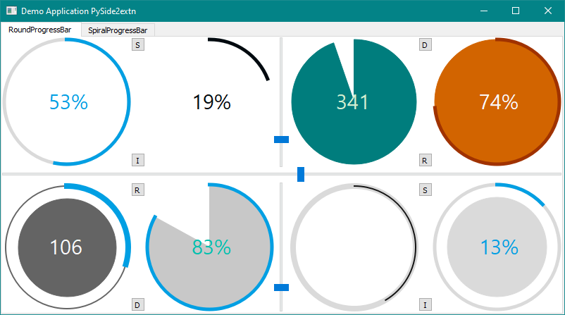
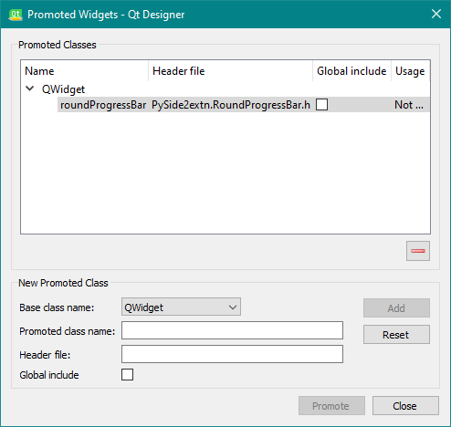
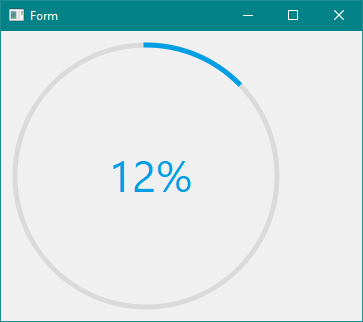

# Getting Started

## Requirements

PySide2extn was manually tested in different test environment(in different OS, Python versions and PySide2 versions). The following data was obtained by conducting tests using Example codes(same one which is given in the Example Section) in the respective version of PySide2 and Python in Windows and Linux(Ubuntu 20.04).

Recommended

```
Windows7-Windows10, Linux, MaxOSX.
```

```
Python >3.7 and PySide2 >5.14.0
```

Other Successful Settings:

*Windows 7 - Windows 10, Linux(Ubuntu 18.04 & 20.04)*

| Python/Pyside2 | Python 3.6.8 | Python 3.7 | Python 3.8 | Python 3.9 |
| :------------: | :----------: | :--------: | :--------: | :--------: |
| PySide2 5.11.0 |  *Success*   |    *NS*    |    *NS*    |    *NS*    |
| PySide2 5.12.0 |      --      |     --     |    *NS*    |    *NS*    |
| PySide2 5.13.0 |  *Success*   | *Success*  |    *NS*    |    *NS*    |
| PySide2 5.14.2 |  *Success*   | *Success*  | *Success*  | *Success*  |
| PySide2 5.15.1 |  *Success*   | *Success*  | *Success*  | *Success*  |

**Note:* *NS* - PySide2 version does not support that Python version, -- : Test not conducted, *Success* : All the example scripts worked flawlessly, *Failed* : Package not working

## Installing PySide2extn/PyQt5extn

* Install PySide2extn using `pip`

``` 
pip install PySide2extn
```

* Install PyQt5extn using `pip`

``` 
pip install PyQt5extn
```

* Install from `.whl` file.

```
pip install <PySide2extn------.whl>file
```


## Quick Demo Application

Quick demo help you to check weather you have successfully installed the Python Package and you are good to go. It comes with a UI loaded with all the widgets in this package with its different customized views. Users can easily differentiate the different styling elements used by widgets.

After installing the PySide2extn/PyQt5extn the users can try out quick demo by:

1. Open the `cmd` or `terminal`. Open `Python`

```python
>> from PySide2extn.demo import demo
>> demo.main()   #PRESS ENTER AND YOU WILL GET A DEMO APPLICATION
```

<p align="center">
  
</p>


## Using with QtDesigner

Many a time designing a GUI is better done using the inbuild QtDesigner as it greatly reduces the designing time. The PySide2extn widgets doesn't natively have the drag and drop widget feature but you can turn a QFrame to a roundProgressBar widget or to any other PySide2extn widgets. The steps to do is detailed below:

* Place a QFrame in the exact place where you want the PySide2extn widget to be.

<p align="center">
  
</p>


* Go to the `Object Inspector` and right click on the QFrame you just created, then click on the `Promote to` menu, you will see a Promote Widget window popup.

<p align="center">
  
</p>


* Create a new Class: for which enter the details(see image) in the `Base Class Name`, `Promoted class name` and `Header file` slots and press `Add`. Here we used the roundProgressBar Class, but you can use any other class in the PySide2extn package.
  * *Base Class Name*: Always `QWidget`
  * *Promoted Class Name* : The class name of the widget you want to use: `roundProgressBar` or `spiralProgressBar`.
  * *Header File*: It is always the `PySide2extn.RoundProgressBar.h` or `PySide2extn.SpiralProgressBar.h`

<p align="center">
  
</p>


* After adding you can see a new Promoted Classes gets one new widget. Then close the Popup.

<p align="center">
  
</p>


* After this again right click on the QFrame that we have created and click on `Morph into` and select the `QWidget` option. Now the QFrame has changes to QWidget. Now once more right click on to the newly formed QWidget and select: `Promote To` and select the `roundProgressBar`option from there.

<p align="center">
  
</p>


* That's it, you have placed a PySide2extn Widget into your Application. At present in the QtDesigner you will not see any image of the roundprogressbar but you can use the roundProgressBar inside the python code you write. Convert the `.ui`file to python file using the `pyside2-uic`and create a new file and write the following code to display the new made window.

  ```python
  import sys
  
  from PySide2 import QtCore, QtGui, QtWidgets
  from PySide2.QtCore import (QCoreApplication, QPropertyAnimation, QDate, QDateTime, QMetaObject, QObject, QPoint, QRect, QSize, QTime, QUrl, Qt, QEvent)
  from PySide2.QtGui import (QBrush, QColor, QConicalGradient, QCursor, QFont, QFontDatabase, QIcon, QKeySequence, QLinearGradient, QPalette, QPainter, QPixmap, QRadialGradient, QPen)
  from PySide2.QtWidgets import *
  
  #IMPORT PYSIDE2EXTN WIDGET YOU USED IN THE QTDESIGNER FOR DESIGNING.
  from PySide2extn.RoundProgressBar import roundProgressBar
  
  #UI FILE CONVERTED FROM .ui to python file ui.py
  from ui import Ui_Form  
  
  class MainWindow(QWidget):
      def __init__(self):
          super(MainWindow, self).__init__()
          self.ui = Ui_Form()
          self.ui.setupUi(self)
  
  if __name__=="__main__":
      app = QApplication(sys.argv)
      window = MainWindow()
      window.show()
      sys.exit(app.exec_())
  ```

   Run this file and we can see the roundProgressBar in the QFrame we made.

  <p align="center">
    
  </p>

## Exploring Further

Dive deeper into the package check the links below.


See: [Examples](example)